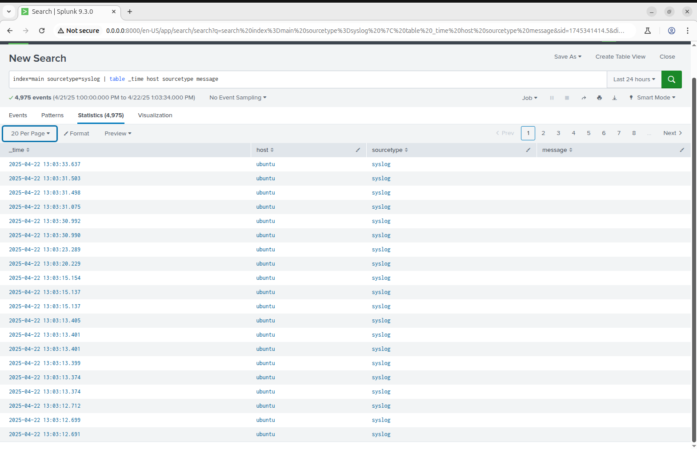

# 🛰️ Day #17: Splunk Basics – Onboard Linux Machine


## 🎯 Objective

Install and configure **Splunk Universal Forwarder** on a remote Ubuntu system to ingest `/var/log/syslog` into a centralized Splunk indexer. Learn how SOC teams centralize logs for threat monitoring and incident response.

---

## 🛠️ Setup

- **Remote Ubuntu Machine** (with UF installed)
- **Splunk Indexer Server** (port 9997 open)
- **Network Access** between UF and Splunk

---

## 🔁 Steps Followed

### ✅ Step 1: Install Splunk Universal Forwarder

```bash
wget -O splunkforwarder-ubuntu.deb https://download.splunk.com/products/universalforwarder/releases/latest/linux/splunkforwarder-latest-linux-2.0-amd64.deb
sudo dpkg -i splunkforwarder-ubuntu.deb
cd /opt/splunkforwarder/bin
sudo ./splunk enable boot-start --accept-license
```

### ✅ Step 2: Forward Logs to Splunk Server

```bash
sudo ./splunk add forward-server <splunk-server-ip>:9997
```

### ✅ Step 3: Monitor Syslog Files

```bash
sudo ./splunk add monitor /var/log/syslog -index main -sourcetype syslog
sudo ./splunk add monitor /var/log/auth.log -index main -sourcetype authlog
sudo ./splunk restart
```
### ✅ Step 4: Enable Listening on Splunk Indexer

On the **Splunk indexer** machine, run:

```bash
sudo /opt/splunk/bin/splunk enable listen 9089
sudo /opt/splunk/bin/splunk list forward-server
```
### ✅ Step 5: Verify in Splunk Web

Use the following query in **Search & Reporting**:

```spl
index=main sourcetype=syslog | table _time host sourcetype message
```
### 📸 Screenshot

> 

---

### 🧠 Observations & Learnings

Centralized log collection allows analysts to correlate logs from multiple machines in one place, enhancing visibility.  
It enables early detection of anomalies, faster investigations, and proactive threat hunting.
